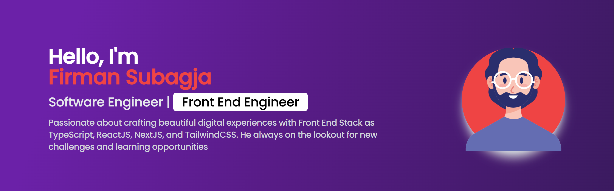

<!--  -->

# Hi Folks!👋 I'm Firman.

	An undergraduate student majoring in Computer Science, he's an enthusiastic and adventurous Front end Developer of various projects. He's currently focusing on my studies to learn the basic fundamentals of Computer Science.

<!-- 
📩 How to reach: subagja.firman33@gmail.com

🌏 See <a href="https://firman-portfolio-steel.vercel.app">he's portfolio website</a>
 -->

🧠 Fact about him:

<ul>
	<li>He graduated from Diploma in Telecommunication Technology at Telkom University in 2021. Switched career from Telecommunication to Fullstack web developer for 1 year and 5 months.
He continued his Diploma to Bachelor extension study in Computer Science at Binus Online Learning.</li>
	<li>After 3 years as a professional in the field of Front end Developer, finally he continued his Diploma to Bachelor extension study in Computer Science at Binus Online Learning.</li>
<!-- 	<li>Switched career from Telecommunication to Fullstack web developer for 1 year and 5 months.</li> -->
	<li>The result of my long learner was appreciated by the founder when I interned at an IT consultant for 3 months and was trusted to hold 2 projects and one of the projects, I became a Tech Leader in the Front End Developer section.</li>
	<li>He was trusted by the founder as a tech leader fullstack web developer as a seasonal for 6 months.</li>
	<li>He hopes that after graduating from the extension from Binus Online Learning, he can advance his career from Front end Developer to AI/ML Engineer.</li>
</ul>

## Tech Stack

### Front-End

	
	
	
	
	
<!-- 	 -->
<!-- 	 -->

### Back-end

	

		
		
		
		
		
<!-- 		 -->
<!-- 		 -->
	

<!-- 	<h4>Or</h4>
	

		
		
		
	
 -->

### Others

	
	
	
	
	
	

## Study in Computer Science

	
	
	

## Programming Language Use Information

<!-- 

	
	
	

	
For 2-3 years now I have been learning several programming languages. Here we can see what I often use hahaha 🙃.

-->

## Other Information

